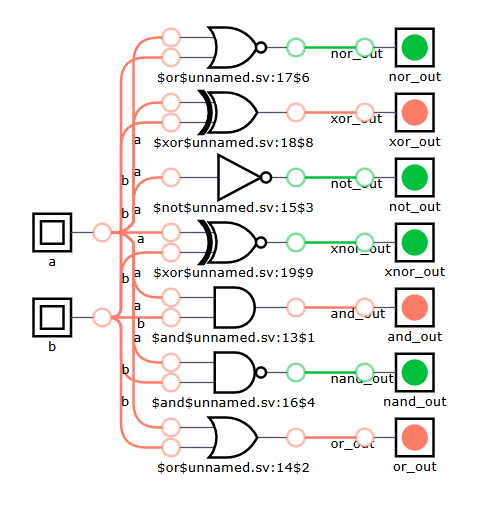
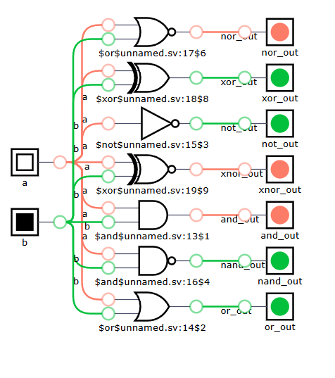
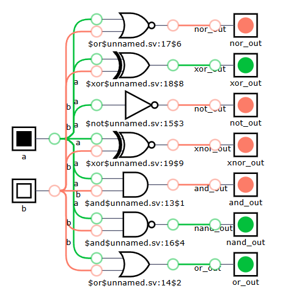
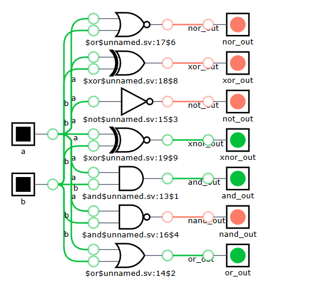

# Basic Logic Gates using Verilog

## Project Overview

This is a beginner-level digital logic design project using **Verilog HDL**.  
The project implements basic logic gates and verifies their outputs using different input combinations.

This project is part of my learning journey as a **Hardware Enthusiast**. Through this project, I practiced basic digital logic, Verilog design, simulation, and GitHub project documentation.

---

## Logic Gates Implemented

The following logic gates are included in this project:

- AND Gate
- OR Gate
- NOT Gate
- NAND Gate
- NOR Gate
- XOR Gate
- XNOR Gate

---

## Tools Used

- Verilog HDL
- ModelSim
- GitHub

---

## Project Files

| File Name | Description |
|---|---|
| `README.md` | Project documentation |
| `basic_gates.v` | Main Verilog design file |
| `basic_gates_tb.v` | Testbench file |
| `logic_gates_a0_b0.png` | Output screenshot for A = 0, B = 0 |
| `logic_gates_a0_b1.png` | Output screenshot for A = 0, B = 1 |
| `logic_gates_a1_b0.png` | Output screenshot for A = 1, B = 0 |
| `logic_gates_a1_b1.png` | Output screenshot for A = 1, B = 1 |

---

## Input and Output Signals

| Signal Name | Type | Description |
|---|---|---|
| `a` | Input | First input signal |
| `b` | Input | Second input signal |
| `and_out` | Output | Output of AND gate |
| `or_out` | Output | Output of OR gate |
| `not_out` | Output | Output of NOT gate using input A |
| `nand_out` | Output | Output of NAND gate |
| `nor_out` | Output | Output of NOR gate |
| `xor_out` | Output | Output of XOR gate |
| `xnor_out` | Output | Output of XNOR gate |

---

## Truth Table

| A | B | AND | OR | NOT A | NAND | NOR | XOR | XNOR |
|---|---|---|---|---|---|---|---|---|
| 0 | 0 | 0 | 0 | 1 | 1 | 1 | 0 | 1 |
| 0 | 1 | 0 | 1 | 1 | 1 | 0 | 1 | 0 |
| 1 | 0 | 0 | 1 | 0 | 1 | 0 | 1 | 0 |
| 1 | 1 | 1 | 1 | 0 | 0 | 0 | 0 | 1 |

---

## Simulation Screenshots

The design was tested using all possible input combinations of `A` and `B`.

### Input Combination: A = 0, B = 0

---

### Input Combination: A = 0, B = 1

---

### Input Combination: A = 1, B = 0

---

### Input Combination: A = 1, B = 1

---

## Result

The basic logic gates were successfully implemented using Verilog HDL.  
The outputs were checked for all possible input combinations, and the results matched the expected truth table.

---

## Learning Outcome

From this project, I learned:

- How to create a basic Verilog design
- How input and output signals work
- How basic logic gates behave
- How to test different input combinations
- How to document a hardware project on GitHub
- How to organize project files professionally

---

## Future Improvements

- Add waveform simulation screenshot
- Add timing analysis report
- Add resource utilization report
- Implement the design on an FPGA board
- Create separate modules for each logic gate

---

## Author

**Nafis-13**  
Hardware Enthusiast | FPGA & Verilog Learner | Digital Logic Design
